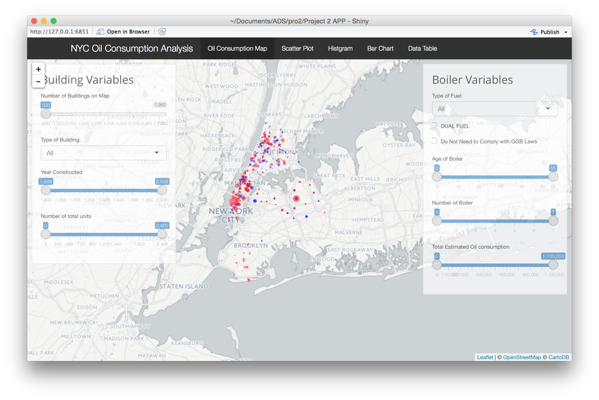

# Project: Open Data NYC - an RShiny app development project
### [Project Description](doc/project2_desc.md)

Term: Fall 2016

+ Team #1
+ Project title: Oil Consumption Analysis
+ Team members
	+ Cen Zeng (cz2379)
	+ Jingdan Zhao (jz2678)
	+ Xuechun Sun (xs2254)
	+ William Raikes (wrr2109)
	
+ Project summary: This exploratory analysis investigates fuel consumption rates for buildings in NYC that contain oil boilers.

The data was extracted from NYC OpenData and can be found [here](https://data.cityofnewyork.us/Housing-Development/Oil-Boilers-Detailed-Fuel-Consumption-and-Building/jfzu-yy6n). 

**Contribution statement**: All team members contributed equally in all stages of this project. All team members approve our work presented in this GitHub repository including this contributions statement. 

